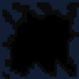

# CUBES BATTLES
## VSB project - Bulanci


Cube battles is a student-written game in C, created to meet the requirements of the UPR project assignment. We were presented with a game [Bulánky](https://www.bulanci.cz/) as a template. You fight as a Cube
against another Cubes, and you're fighting for the best score.

## Building the project

To be able to build this project, you have to follow these 4 steps:

1. Download the source folder of project, from my github page.
2. Create a build directory inside the game folder.
3. Inside this directory, open command line, and run this comands to build it:

```
cmake ..
make
```

4. When it is built, you can start the game by executing ```./game```.

>If you are using Windows, you need to change the [CMakeLists.txt](CMakeLists.txt)

>It is important to have the resolution of the screen 1920x1080 or higher. Or else you would be unable to see the whole screen.


## Let's get started
When you start the game, you encounter the main menu screen, there you have options to **start the game**, view the **leaderboard** or **exit the game**.


If you press the button **New Game**, you will be transfered to new screen with options to set the players.
You have 3 options to choose from:
1. Player

    

2. Bot

    

3. Nothing

    

And then you can choose the **collor** of current Player/Bot.
If you have everything set up, you can click on **Play** button, and start the game.

## Player Controls
The first choosed player has the *W,A,S,D* keys for movement and *SPACE* to shoot.

The second choosed player has the *ARROWS* keys for movement and *0* or *Right CTRL* to shoot.
>You can have only 2 active players at the same time.


## Gameplay
When you are in game, you tries not die and kill other players/bots. You can hide behind obstacles, collect power ups, shoot and dodge projectiles and many more.

The score on the lef upper side is from first player and on the other side is for the second player.


## End of the game
The game will end after 1 minute and 30 seconds, and then the best player would be evaluated.

If you are the best player, type in your username and click on continue.


# Game features

## Cubes
The Cube represents the player or the bot. You can move, shoot and die. If cube kills someone, the score would increment.
If you get hit the color of the cube started to shade away. Every Cube starts with 100 health.

                

## Power up
In this game there are 4 power ups spawn, marked with white and blue rectangles.


The power up spawns every 5 seconds on random spawner. If you cross him, you pick him up, and have 9 seconds to use it, after the timer, it automaticly switch to the basic gun attack.

### Types of power ups
|Name|Power up|Projectil|Range|Damage|Description|
|:---:|:---:|:---:|:---:|:---:|:---:|
|Gun|||Long range|50|Default power up, it allows you to shoot single bullet in forward direction.|
|Shotgun|||Short range|35|It allows you to shoot 5 spreaded bullets in forward direction.|
|Rocket|||Infinite range|0|Rocket is special projectil, it has infinite range, but when it collides with, [Obstacle](#Obstacles), [Cubes](#Cubes), or with borders. It would explode, and spreaded 8 more gun bullets in every direction. |
|Mine|||0 range|100|It allows you to place the mine on the ground, when enemy steps on it it would be instantly vaporized, but placed mines will automaticly disappers after 30 seconds.|

## Obstacles
In the game are 2 types of obstacles:
1. The pink walls, which are unsurpassable and unshootable.


2. The holes, which are unsurpassable, but you can shoot across them.



## Bot logic
In this game, the bot logic is not much complicated, it simply follows the player, and tries to shoot it. It calculets the distance for the clossest player, and for the clossest power up. If power up is closer then the player, it follows that path. If bot collide with any structure it would go around it, there shouldn´t be any place, where bot can be stacked.


# The Project structure
This game is made in C language using mostly SDL library. The game is separeted into 6 folders:
|Folder|Description|
|---|:---:|
|[Assets](./Assets/)|There are all assets for the game. |
|[Config](./Config/)|Main config for sdl setup, keybindings and dynamic arrays. |
|[Player](./Player/)|There are all of the player scripts, and bot logic. |
|[Scenes](./Scenes/)|There are scenes and screens settings and also the obstacles scripts. |
|[Sounds](./Sounds/)|Folder for managing sounds. Actually just the background music. |
|[Weapons](./Weapons/)|In this folder are mechanics for projectiles and power ups. |

## Links

VSB UPR course

* [VSB UPR github](https://github.com/geordi/upr-course)

SDL documentation:

* [SDL documentation](https://wiki.libsdl.org/SDL3/FrontPage)

``` 
MIT License

Copyright (c) 2023 Jochen Scheib

Permission is hereby granted, free of charge, to any person obtaining a copy
of this software and associated documentation files (the "Software"), to deal
in the Software without restriction, including without limitation the rights
to use, copy, modify, merge, publish, distribute, sublicense, and/or sell
copies of the Software, and to permit persons to whom the Software is
furnished to do so, subject to the following conditions:

The above copyright notice and this permission notice shall be included in all
copies or substantial portions of the Software.

THE SOFTWARE IS PROVIDED "AS IS", WITHOUT WARRANTY OF ANY KIND, EXPRESS OR
IMPLIED, INCLUDING BUT NOT LIMITED TO THE WARRANTIES OF MERCHANTABILITY,
FITNESS FOR A PARTICULAR PURPOSE AND NONINFRINGEMENT. IN NO EVENT SHALL THE
AUTHORS OR COPYRIGHT HOLDERS BE LIABLE FOR ANY CLAIM, DAMAGES OR OTHER
LIABILITY, WHETHER IN AN ACTION OF CONTRACT, TORT OR OTHERWISE, ARISING FROM,
OUT OF OR IN CONNECTION WITH THE SOFTWARE OR THE USE OR OTHER DEALINGS IN THE
SOFTWARE.
```
